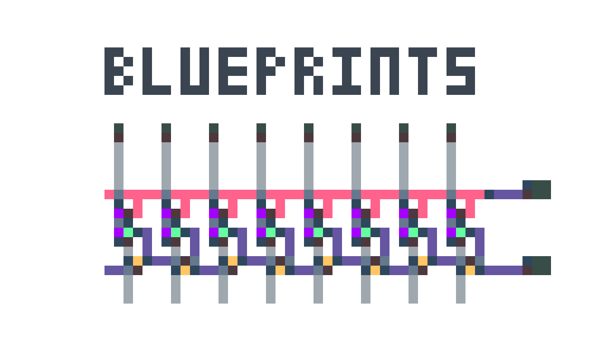

Virtual Circuit Board Blueprint is a tool for converting VCB blueprint to and from images.

## Examples

Reads the system clipboard for a blueprint and outputs an image of the blueprint content scale up by a factor of  10.

`$ vcbb decode -c -s 10`

Reads an image file and writes the blueprint to stdout.

`$ vcbb encode blueprint.png`